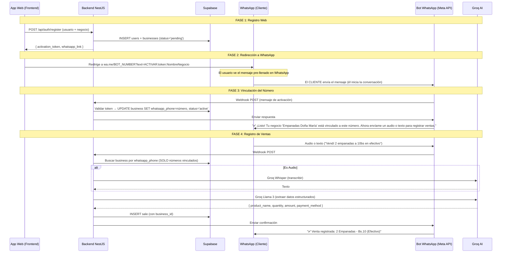

# WhatsApp + Groq: Registro Automático de Ventas con Soporte Multi-Negocio

Implementar el flujo completo: registro web → redirección a WhatsApp con mensaje pre-llenado → el cliente inicia la conversación → vinculación del número → registro de ventas por audio/texto.

## Flujo Completo del Sistema



### El Link de Redirección (Clave del Diseño)

Después del registro, el frontend recibe un link con este formato:
```
https://wa.me/591XXXXXXXX?text=ACTIVAR%3Aabc123token%3AEmpanadas%20Do%C3%B1a%20Mar%C3%ADa
```

Que WhatsApp traduce a un mensaje pre-llenado:
```
ACTIVAR:abc123token:Empanadas Doña María
```

El cliente solo tiene que presionar **"Enviar"**. Al hacerlo:
- El bot recibe el mensaje desde el número del cliente.
- Valida el token `abc123token` contra la DB.
- Vincula ese número al negocio.
- **Ese número es ahora el ÚNICO que puede registrar ventas de ese negocio.**

---

## User Review Required

> [!IMPORTANT]
> **Rediseño de la DB**: Se crea `businesses` y se modifican `users` y `sales`. Requiere ejecutar nuevo SQL en Supabase.

> [!WARNING]
> **Seguridad del Bot**: Números NO vinculados reciben un mensaje genérico y son ignorados. Sin excepciones.

> [!IMPORTANT]
> **Variables de entorno nuevas**: Se necesita `WHATSAPP_VERIFY_TOKEN` (un string que tú inventes, ej: `tinka_verify_2024`) para la verificación del webhook de Meta.

## Open Questions

> [!IMPORTANT]
> 1. **¿1 usuario = 1 negocio?** El plan actual asume esto. Si quieres que un usuario tenga múltiples negocios, dime.
> 2. **¿Tienes `ngrok` o dominio público?** Meta necesita una URL pública para el webhook.
> 3. **¿El número del bot (WHATSAPP_PHONE_NUMBER_ID) ya está configurado en Meta Developer?**

---

## Proposed Changes

### Database Redesign

#### [MODIFY] [init.sql](file:///c:/Users/JHUNIOR/TINKA-COCHATECH/backend/src/database/init.sql)

Rediseño completo:

**Nueva tabla `businesses`:**
```sql
CREATE TABLE IF NOT EXISTS businesses (
  id UUID DEFAULT gen_random_uuid() PRIMARY KEY,
  owner_id UUID REFERENCES users(id) ON DELETE CASCADE,
  business_name TEXT NOT NULL,
  business_type TEXT,                -- "Comida", "Artesanía", etc.
  whatsapp_phone TEXT UNIQUE,        -- NULL hasta que el cliente active
  activation_token TEXT UNIQUE,      -- Token temporal para vincular
  activation_expires_at TIMESTAMPTZ, -- Expira en 24h
  status TEXT DEFAULT 'pending',     -- pending | active | suspended
  created_at TIMESTAMPTZ DEFAULT now(),
  updated_at TIMESTAMPTZ DEFAULT now()
);
```

**Cambios en `sales`:**
```sql
-- Agregar columnas a sales:
business_id UUID REFERENCES businesses(id),
quantity INTEGER DEFAULT 1,
source TEXT DEFAULT 'web',       -- 'web' | 'whatsapp_text' | 'whatsapp_audio'
raw_message TEXT                 -- Mensaje original del usuario
```

**Nuevos índices:**
```sql
CREATE INDEX idx_businesses_whatsapp_phone ON businesses(whatsapp_phone);
CREATE INDEX idx_businesses_activation_token ON businesses(activation_token);
CREATE INDEX idx_sales_business_id ON sales(business_id);
```

---

### Auth Module (Registro crea negocio + genera link WhatsApp)

#### [MODIFY] [register.dto.ts](file:///c:/Users/JHUNIOR/TINKA-COCHATECH/backend/src/modules/auth/dto/register.dto.ts)
Agregar campos del negocio:
```typescript
export class RegisterDto {
  @IsEmail()
  email: string;

  @IsString() @MinLength(3)
  full_name: string;

  @IsString() @MinLength(6)
  password: string;

  @IsString() @IsNotEmpty()
  phone: string;

  // --- Datos del negocio ---
  @IsString() @IsNotEmpty()
  business_name: string;

  @IsString() @IsOptional()
  business_type?: string;
}
```

#### [MODIFY] [auth.service.ts](file:///c:/Users/JHUNIOR/TINKA-COCHATECH/backend/src/modules/auth/auth.service.ts)
Implementar registro real contra Supabase:
```
register(dto):
  1. Hash del password con bcrypt
  2. INSERT en users → obtener user.id
  3. Generar activation_token (crypto.randomUUID().slice(0,8))
  4. INSERT en businesses (owner_id, business_name, activation_token, status='pending')
  5. Construir el link de WhatsApp:
     whatsapp_link = `https://wa.me/${BOT_NUMBER}?text=ACTIVAR:${token}:${businessName}`
  6. Retornar { access_token, user, business, whatsapp_link }
```

#### [MODIFY] [auth.module.ts](file:///c:/Users/JHUNIOR/TINKA-COCHATECH/backend/src/modules/auth/auth.module.ts)
Sin cambios estructurales significativos.

---

### WhatsApp Module (Core del sistema)

#### [NEW] [whatsapp.module.ts](file:///c:/Users/JHUNIOR/TINKA-COCHATECH/backend/src/modules/whatsapp/whatsapp.module.ts)
- Importa `SalesModule`.
- Registra `WhatsAppController`, `WhatsAppService`, `GroqService`.

#### [NEW] [whatsapp.controller.ts](file:///c:/Users/JHUNIOR/TINKA-COCHATECH/backend/src/modules/whatsapp/whatsapp.controller.ts)
```
GET  /webhook/whatsapp  → Verificación del webhook Meta (challenge)
POST /webhook/whatsapp  → Recibe mensajes entrantes
```

> [!NOTE]
> Se excluye del global prefix `/api` para que Meta pueda alcanzar la URL limpia. Se configura en `main.ts` con `app.setGlobalPrefix('api', { exclude: ['webhook/whatsapp'] })`.

#### [NEW] [whatsapp.service.ts](file:///c:/Users/JHUNIOR/TINKA-COCHATECH/backend/src/modules/whatsapp/services/whatsapp.service.ts)
Flujo principal:
```
processIncomingMessage(senderPhone, message):

  1. ¿Es un mensaje de ACTIVACIÓN? (empieza con "ACTIVAR:")
     → Parsear token del mensaje
     → Buscar business por activation_token
     → Si existe y no ha expirado:
         UPDATE business SET whatsapp_phone = senderPhone, status = 'active'
         Enviar "✅ ¡Negocio vinculado!"
     → Si no existe o expiró:
         Enviar "❌ Token inválido o expirado. Regístrate en tinka.app"
     → RETURN

  2. ¿Está vinculado? Buscar business por whatsapp_phone = senderPhone
     → Si NO existe:
         Enviar "⚠️ Este número no está registrado. Regístrate en tinka.app"
         RETURN
     → Si está suspendido:
         Enviar "⚠️ Tu negocio está suspendido."
         RETURN

  3. PROCESAR VENTA (solo llega aquí si el número está vinculado y activo)
     → Si es audio: descargar de Meta → transcribir con Groq Whisper
     → Si es texto: usar directamente
     → Extraer datos con Groq Llama 3 → JSON
     → INSERT en sales con business_id
     → Enviar "✅ Venta registrada: ..."
```

Métodos auxiliares:
- `sendWhatsAppMessage(to, body)` — Envía via Meta Cloud API.
- `downloadWhatsAppMedia(mediaId)` — Descarga audio de Meta.
- `findBusinessByPhone(phone)` — Busca en `businesses` por `whatsapp_phone`.
- `activateBusiness(token, phone)` — Vincula número al negocio.

#### [NEW] [groq.service.ts](file:///c:/Users/JHUNIOR/TINKA-COCHATECH/backend/src/modules/whatsapp/services/groq.service.ts)
- `transcribeAudio(audioBuffer: Buffer): Promise<string>` — Groq Whisper (`whisper-large-v3-turbo`).
- `extractSaleData(text: string): Promise<ExtractedSaleData>` — Groq Llama 3 con system prompt estricto.
- Sanitización: regex para extraer JSON de la respuesta, `try/catch` en parse.

**System Prompt para extracción:**
```
Eres un asistente de registro de ventas para microemprendedores en Bolivia.
El usuario te dirá qué vendió. Extrae los datos y responde ÚNICAMENTE con JSON válido.
Claves del JSON:
- "product_name": string (qué vendió, con cantidad incluida, ej: "2 Empanadas")
- "quantity": number (cantidad de items)
- "amount": number (monto total numérico en bolivianos)
- "payment_method": string ("Efectivo" | "QR" | "Transferencia" | "Tarjeta")
Si no se menciona método de pago, asume "Efectivo".
Si no se menciona cantidad, asume 1.
NO incluyas texto extra. SOLO el JSON.
```

#### [NEW] [whatsapp.types.ts](file:///c:/Users/JHUNIOR/TINKA-COCHATECH/backend/src/modules/whatsapp/types/whatsapp.types.ts)
- Interfaces para el payload del webhook de Meta.
- `ExtractedSaleData` interface.

---

### Sales Module (Ajustes multi-negocio)

#### [MODIFY] [sale.entity.ts](file:///c:/Users/JHUNIOR/TINKA-COCHATECH/backend/src/modules/sales/entities/sale.entity.ts)
Agregar: `business_id`, `quantity`, `source`, `raw_message`.

#### [MODIFY] [create-sale.dto.ts](file:///c:/Users/JHUNIOR/TINKA-COCHATECH/backend/src/modules/sales/dto/create-sale.dto.ts)
Agregar campos opcionales: `business_id`, `quantity`, `source`.

#### [MODIFY] [sales.service.ts](file:///c:/Users/JHUNIOR/TINKA-COCHATECH/backend/src/modules/sales/sales.service.ts)
- Actualizar `createSale()` para incluir `business_id`, `source`, `quantity`, `raw_message`.
- Actualizar queries para filtrar por `business_id`.

---

### Config & Infra

#### [MODIFY] [supabase.config.ts](file:///c:/Users/JHUNIOR/TINKA-COCHATECH/backend/src/config/supabase.config.ts)
- Usar `SUPABASE_ANON_KEY` en vez de `SUPABASE_KEY` (match con .env actual).

#### [MODIFY] [main.ts](file:///c:/Users/JHUNIOR/TINKA-COCHATECH/backend/src/main.ts)
- Excluir `/webhook/whatsapp` del global prefix `api`.

#### [MODIFY] [app.module.ts](file:///c:/Users/JHUNIOR/TINKA-COCHATECH/backend/src/app.module.ts)
- Importar `WhatsAppModule`.

#### [MODIFY] [.env](file:///c:/Users/JHUNIOR/TINKA-COCHATECH/backend/.env)
- Agregar `WHATSAPP_VERIFY_TOKEN=tinka_verify_2024`.

#### NPM Dependencies:
```bash
npm install groq-sdk form-data
```

---

## Verification Plan

### Automated Tests
1. `npm run build` — compila sin errores.
2. **Test registro**: `POST /api/auth/register` → verificar que retorna `whatsapp_link` correcto.
3. **Test activación**: Simular webhook con mensaje `ACTIVAR:token:Negocio` → verificar que `businesses.status = 'active'`.
4. **Test venta por texto**: Simular webhook con texto → verificar INSERT en `sales`.
5. **Test número no registrado**: Simular webhook desde número desconocido → verificar que NO se crea venta.

### Manual Verification
1. Abrir el `whatsapp_link` del registro → verificar que WhatsApp se abre con mensaje pre-llenado.
2. Enviar el mensaje → verificar vinculación en Supabase.
3. Enviar texto de venta → verificar registro en `sales`.
4. Enviar audio de venta → verificar transcripción + registro.
5. Enviar desde número no registrado → verificar rechazo.
